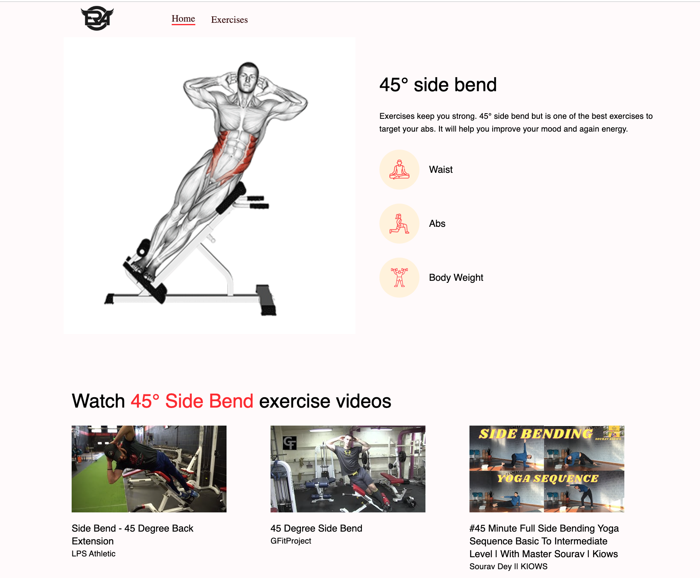

## React_Fitness_Exercises_App 

You can view the site here
[Click Me](https://era-gym-app.netlify.app/)

## Table of Contents

- [About](#about)
- [Technologies used](#technologies-used)
- [Features](#features)
- [Author](#author)

## About
 - Тhis application contains functionality to choose exercise categories and specific muscle groups, browse more than one thousand exercises with practical examples, pagination, exercise details, pull related videos from youtube, display similar exercises, and much more.
   
## Technologies used
- ReactJS
- Material UI
- RAPID API for fetching exercise and video data

## Features
<ul>
  <li>Home</li>
  <li>Exercises</li>
</ul>

## Author

Ramadan Emin

